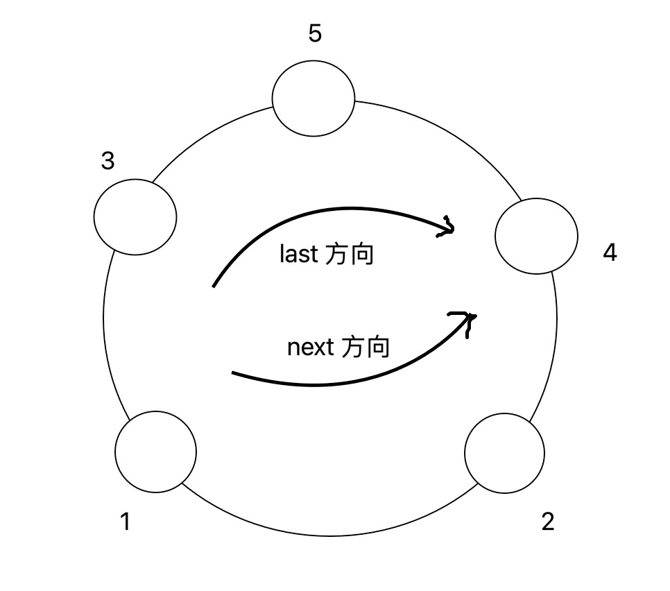

# 可见的山峰对数量


## 题目

一个不含有负数的数组可以代表一圈环形山，每个位置的值代表山的高度。比如，{3, 1, 2, 4, 5}、{4, 5, 3, 1, 2} 或 {1, 2, 4, 5, 3} 都代表同样结构的环形山。3->1->2->4->5->3 方向叫作 next 方向（逆时针），3->5->4->2->1->3 方向焦作 last 方向（顺时针），如图所示：



山峰 A 和山峰 B 能够相互看见的条件为：

1. 如果 A 和 B 是同一座山，认为不能相互看见。
2. 如果 A 和 B 是不同的山，并且在环中相邻，认为可以相互看见。比如图中相邻的山峰对有 (1, 2)(2, 4)(4, 5)(3, 5)(1, 3)
3. 如果 A 和 B 是不同的山，并且在环中不相邻，假设两座山高度的最小值为 min。如果 A 通过 next 方向到 B 的途中没有高度比 min 大的山峰，或者 A 通过 last 方向到 B 的途中没有高度比 min 大的山峰，认为 A 和 B 可以相互看见。比如图中，高度为 3 的山和高度为 4 的山，两座山的高度是最小值为 3。3 从 last 方向走向 4，中途会遇见 5，所以 last 方向走不通；3 从 next 方向走到 4，中途会遇见 1 和 2，但是都不大于两座山高度的最小值 3，所以 next 方向可以走通。

有一个能走通就认为可以相互看见。再如，高度为 2 的山和高度为 5 的山，两个方向上都走不通，所以不能相互看见。图中所有在环中不相邻，并且能看见的山峰对有 (2, 3)(3, 4)。

​    给定一个不含有负数且没有重复值的数组 arr，请返回有多少对山峰能够相互看见。

​    **进阶问题：给定一个不含有负数但可能含有重复值的数组 arr，返回有多少对山峰能够相互看见。**

【要求】

如果 arr 长度为 N，没有重复值的情况下时间复杂度达到 O(1) ，可能有重复值的情况下时间复杂度达到 O(N)。

## 总结

对于原始问题：

数组 arr 中不存在重复元素，题目答案可以直接通过公式求解出来，公式如下

```text
// i 环形中山峰的数量
nums = 2 x i - 3
```

对于进阶问题：

需要借助单调栈结构来实现，通过 “小找大” 的方式，就能按顺序有条理地计算出可见山峰对数

具体的流程如下：

1. 准备一个 Record 结构，保存山峰高度和出现次数，出现次数不一定指的是山峰连续出现的次数，它们中间可能夹杂着一些其他的山峰，但是高度必定比当前山峰高度要低

2. 初始化一个单调栈，找到环中任意一个最大值，压入栈中

3. 从最大值位置的 next 方向下一个位置开始，顺序遍历环

4. 每遍历到一个位置 idx，需要判断能否入栈：

   - `arr[idx] > stack.peek().value`: 不符合单调栈规则，需要循环弹出栈顶，并结算可见山峰对

     对于弹出的栈顶 cur，arr[idx] 和当前的新栈顶就恰好是离 cur 最近的两座比它高的山峰，cur 的出现次数为 k 次，那么可以结算出 `2 * k + C(2, k)` 对可见山峰对

   - `arr[idx] <= stack.peek().value`: 符合单调栈规则，入栈前要判断栈顶元素是否等于当前值，是则增加栈顶的出现次数，否则初始化新 record

5. 环遍历结束后的清栈环节，共分为 3 个小阶段

   1. 栈中剩余元素个数大于 2：

      循环弹出栈顶 cur，出现次数为 k，可结算出 `2 * k + C(2, k)` 对可见山峰对

   2. 栈中剩余元素个数等于 2：

      弹出栈顶 cur，出现次数为 k，此时栈中剩余一个元素，出现次数为 m。如果 `m == 1`，可结算出 `k + C(2, k)` 对可见山峰对，如果 `m > 1` 可结算出 `2 * k + C(2, k)` 对可见山峰对

   3. 栈最后必定剩有一个元素：

      因为一开始压栈的是环中的最大值，根据单调栈的入栈规则，环中已没有元素可以让最大值弹出结算。

      那么剩最后一个元素时，出现次数为 k，可以结算出的山峰对个数就是 k 个山峰两两互相看见的山峰对个数：`C(2, k)`

