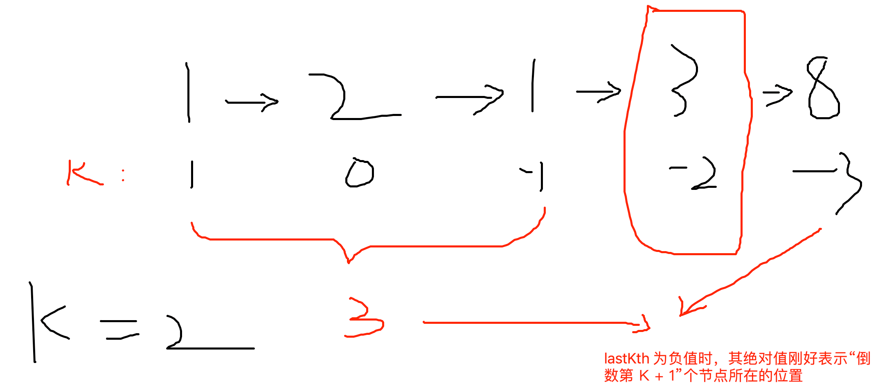

# 在单链表和双链表中删除倒数第 K 个节点

## 描述

分别实现两个函数，一个可以删除单链表中倒数第 K 个节点，另一个可以删除双链表中倒数第 K 个节点。

【要求】

如果链表长度为 N，时间复杂对打到 O(N)，额外空间复杂度达到 O(1)。

## 总结

首先，从链表根节点开始，往后进行遍历（包含根节点），每遍历到一个非空的节点，就将 lastKth 的值进行自减

遍历结束后，lastKth 可能会出现三种情况：

1. `lastKth > 0`: 链表不存在倒数第 lastKth 个节点，无需作任何处理，直接返回

2. `lastKth == 0`: 链表头节点刚好是倒数第 lastKth 个节点，移除头节点后进行返回

3. `lastKth < 0`:

   链表倒数第 lastKth 个节点在链表的中间某个位置，并且已经知道了倒数第 lastKth + 1 个节点在链表中的位置：

   

   只需要回到头节点，重新遍历到倒数第 lastKth + 1 位置节点，就可以成功删除掉倒数第 lastKth 个节点

双链表的解题思路与单链表相似，区别是在删除中间节点时，要把节点的 last 关系也维护好
